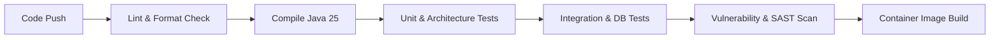

# Git & CI/CD Standards

This document establishes standards for version control, commit conventions, branch workflows, pull request quality gates, Docker containerization, and CI/CD automation.

> **Severity Levels**:
> - 🔴 **MUST**: Non-negotiable requirement. Violations will fail CI checks or block code review approval.
> - 🟡 **SHOULD**: Strongly recommended practice. Deviations require team consensus and documented rationale.
> - 🟢 **MAY**: Optional guideline or contextual optimization.

---

## 1. Conventional Commits 🔴 MUST

All commit messages must follow the [Conventional Commits](https://www.conventionalcommits.org/) specification (v1.0.0). This enables automated changelog generation, semantic versioning, and clean repository history.

### Commit Format

```
<type>(<optional-scope>): <description>

[optional body]

[optional footer(s)]
```

### Commit Types

| Type | Description | Triggers SemVer |
|---|---|---|
| `feat` | A new feature or capability | MINOR |
| `fix` | A bug fix | PATCH |
| `docs` | Documentation changes only | PATCH |
| `style` | Formatting, missing semi-colons, whitespace (no code change) | None |
| `refactor` | Code change that neither fixes a bug nor adds a feature | None |
| `perf` | Performance improvement | PATCH |
| `test` | Adding or updating tests | None |
| `build` | Changes affecting build system or external dependencies (Maven, Gradle) | None |
| `ci` | Changes to CI/CD configuration files and scripts (GitHub Actions, etc.) | None |
| `chore` | Routine maintenance tasks, dependency bumps, housekeeping | None |
| `revert` | Reverts a previous commit | Depends |

### Rules & Constraints

- 🔴 **MUST**: Use imperative, present tense in description (e.g. `add auth filter` not `added auth filter` or `adds auth filter`).
- 🔴 **MUST**: Do not capitalize the first letter of the description.
- 🔴 **MUST**: Do not end the description with a period.
- 🔴 **MUST**: Limit the subject line to **72 characters** maximum.
- 🔴 **MUST**: Indicate breaking changes either with `!` before `:` (e.g. `feat(auth)!: replace cookie with bearer token`) or with `BREAKING CHANGE:` in the footer.
- 🟡 **SHOULD**: Include a body explaining *what* changed and *why* for non-trivial commits.

```git
# ✅ GOOD: Clear conventional commit with scope
feat(auth): add tenant context extraction to jwt filter

Extract tenant_id claim from validated JWT and bind to ScopedValue
tenant context for downstream service layers.

Closes #142

# ✅ GOOD: Breaking change commit
refactor(api)!: migrate error responses to rfc 9457 problem details

BREAKING CHANGE: The custom ApiError response body is replaced by
Standard ProblemDetails schema. Downstream clients must update parser.

# ❌ BAD: Vague, non-conventional commit messages
fix stuff
Update UserController.java
WIP
fixed bug in authentication logic.
```

---

## 2. Branch Naming Strategy 🔴 MUST

Branch names must be structured, lowercase, and hyphen-separated to enable automated branch-based CI triggers.

### Branch Prefix Conventions

| Prefix | Pattern | Purpose |
|---|---|---|
| `feature/` | `feature/<ticket-id>-<short-description>` | New features or enhancements |
| `bugfix/` | `bugfix/<ticket-id>-<short-description>` | Bug fixes for non-critical/planned issues |
| `hotfix/` | `hotfix/<ticket-id>-<short-description>` | Urgent fixes deployed directly to production |
| `release/` | `release/v<major>.<minor>.<patch>` | Release preparation and stabilization |
| `chore/` | `chore/<short-description>` | Tooling, dependency, or documentation updates |

```bash
# ✅ GOOD: Standardized branch names
feature/IAM-102-oauth2-pkce-flow
bugfix/ORDER-45-fix-tax-rounding-error
hotfix/PAY-88-stripe-webhook-signature
chore/bump-spring-boot-4-0-1

# ❌ BAD: Unstructured or ambiguous branch names
my-feature
fix-bug
john/testing
test_123
```

- 🔴 **MUST**: Protect `main` (or `master`) branch — direct pushes are strictly prohibited.
- 🔴 **MUST**: Delete branches automatically upon merging to prevent repository clutter.

---

## 3. Pull Request Standards & Quality Gates 🔴 MUST

Pull requests (PRs) serve as the primary quality gate for human and automated review.

### PR Requirements

- 🔴 **MUST**: Keep PRs focused and atomic. Target < 400 lines of functional changes (excluding generated code or migrations).
- 🔴 **MUST**: Provide a clear PR description using the standard template:
  - **Summary**: Concise overview of what changed.
  - **Motivation**: Why the change is necessary (link to issue/ticket).
  - **Testing Performed**: Automated tests added, manual verification steps.
  - **Breaking Changes**: Explicit callout of any API or schema incompatibilities.
- 🔴 **MUST**: All automated CI checks (build, test, ArchUnit, linter, security scan) must pass before merging.
- 🔴 **MUST**: Require at least one approving code review from a code owner / peer reviewer.
- 🔴 **MUST**: Keep Git history clean. Use **Squash and Merge** for feature branches or **Rebase and Merge** for linear history without merge bubbles.
- 🟡 **SHOULD**: Include screenshots or API payload examples for user-facing or API changes.

---

## 4. CI/CD Automation Pipeline 🔴 MUST

Every pull request and merge to `main` must run through an automated CI pipeline.



### Mandatory CI Stages

1. **Lint & Formatting Check**:
   - Verify code formatting (Spotless, Checkstyle, or ktlint).
   - 🔴 **MUST**: Fail the build if formatting violations exist. Developers must format locally before pushing (`./gradlew spotlessApply` or `mvn spotless:apply`).

2. **Compilation**:
   - Compile against target **Java 25** bytecode with compiler warnings treated as errors (`-Werror`).

3. **Architecture & Unit Testing**:
   - Execute all unit tests and ArchUnit architecture rule tests.
   - 🔴 **MUST**: Zero failing tests permitted.

4. **Integration Testing**:
   - Execute integration tests with Testcontainers (PostgreSQL, Redis, Kafka).
   - Verify Liquibase database migrations apply cleanly on an empty schema.

5. **Security & Dependency Scanning**:
   - Run dependency vulnerability checks (Dependabot, Snyk, or OWASP Dependency-Check).
   - 🔴 **MUST**: Fail the build for dependencies with known HIGH or CRITICAL severity CVEs without an active remediation plan.

---

## 5. Docker & Containerization Standards 🟡 SHOULD

Container images must be lightweight, secure, and production-ready.

### Container Rules

- 🔴 **MUST**: Use **multi-stage builds** — separate the build stage (JDK + build tool) from the runtime stage (minimal JRE).
- 🔴 **MUST**: Run the application container as a **non-root user**. Never run Java containers as `root`.
- 🔴 **MUST**: Use minimal, audited base images (e.g. `eclipse-temurin:25-jre-alpine` or Google Distroless).
- 🔴 **MUST**: Never bake secrets, credentials, or `.env` files into the Docker image.
- 🟡 **SHOULD**: Configure container-aware JVM flags (`-XX:MaxRAMPercentage=75.0`, `-XX:InitialRAMPercentage=50.0`).
- 🟡 **SHOULD**: Define explicit `HEALTHCHECK` instructions pointing to Spring Boot Actuator `/actuator/health/liveness`.
- 🟡 **SHOULD**: Include `.dockerignore` to exclude `.git`, `build/`, `target/`, `.idea/`, and documentation from build context.

```dockerfile
# ✅ GOOD: Multi-stage, non-root, minimal runtime Dockerfile
# Stage 1: Build
FROM eclipse-temurin:25-jdk-alpine AS builder
WORKDIR /workspace
COPY gradlew .
COPY gradle gradle
COPY build.gradle.kts settings.gradle.kts ./
RUN ./gradlew dependencies --no-daemon

COPY src src
RUN ./gradlew bootJar --no-daemon -x test

# Stage 2: Runtime
FROM eclipse-temurin:25-jre-alpine AS runtime
RUN addgroup -S appgroup && adduser -S appuser -G appgroup

WORKDIR /app
COPY --from=builder /workspace/build/libs/*.jar app.jar
RUN chown -R appuser:appgroup /app

USER appuser

EXPOSE 8080

ENV JAVA_OPTS="-XX:MaxRAMPercentage=75.0 -XX:+UseZGC -XX:+ExitOnOutOfMemoryError"

HEALTHCHECK --interval=15s --timeout=3s --retries=3 \
  CMD wget -qO- http://localhost:8080/actuator/health/liveness || exit 1

ENTRYPOINT ["sh", "-c", "java $JAVA_OPTS -jar app.jar"]
```

```dockerfile
# ❌ BAD: Single stage, runs as root, heavy base image, hardcoded heap
FROM openjdk:latest
COPY . /app
WORKDIR /app
RUN ./mvnw package
ENTRYPOINT ["java", "-Xmx4g", "-jar", "target/app.jar"]
```

---

## 6. Dependency Management & Versioning 🔴 MUST

- 🔴 **MUST**: Centralize dependency versions using a Bill of Materials (BOM) or Gradle platform (`platform(...)`). Do not specify explicit version numbers on individual library declarations.
- 🔴 **MUST**: Never use dynamic or floating version ranges (e.g. `1.+`, `LATEST`, `RELEASE`). Every dependency must resolve to a deterministic, pinned version.
- 🔴 **MUST**: Enable automated dependency vulnerability updates (Dependabot or Renovate) configured for weekly reviews.
- 🟡 **SHOULD**: Maintain an approved dependency policy — evaluate license compatibility (Apache-2.0, MIT vs AGPL) before introducing new third-party libraries.
