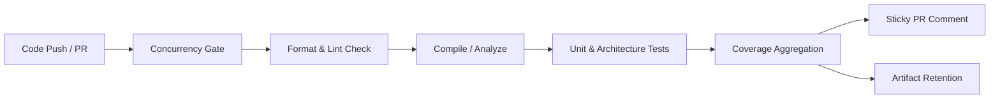

# Git & CI/CD Standards

This document establishes standards for version control, commit conventions, branch workflows, pull request quality gates, Docker containerization, and CI/CD automation.

> **Severity Levels**:
> - 🔴 **MUST**: Non-negotiable requirement. Violations will fail CI checks or block code review approval.
> - 🟡 **SHOULD**: Strongly recommended practice. Deviations require team consensus and documented rationale.
> - 🟢 **MAY**: Optional guideline or contextual optimization.

---

## 1. Conventional Commits 🔴 MUST

All commit messages must follow the [Conventional Commits](https://www.conventionalcommits.org/) specification (v1.0.0). This enables automated changelog generation, semantic versioning, and clean repository history.

### Commit Format

```
<type>(<optional-scope>): <description>

[optional body]

[optional footer(s)]
```

### Commit Types

| Type | Description | Triggers SemVer |
|---|---|---|
| `feat` | A new feature or capability | MINOR |
| `fix` | A bug fix | PATCH |
| `docs` | Documentation changes only | PATCH |
| `style` | Formatting, missing semi-colons, whitespace (no code change) | None |
| `refactor` | Code change that neither fixes a bug nor adds a feature | None |
| `perf` | Performance improvement | PATCH |
| `test` | Adding or updating tests | None |
| `build` | Changes affecting build system or external dependencies (Maven, Gradle) | None |
| `ci` | Changes to CI/CD configuration files and scripts (GitHub Actions, etc.) | None |
| `chore` | Routine maintenance tasks, dependency bumps, housekeeping | None |
| `revert` | Reverts a previous commit | Depends |

### Rules & Constraints

- 🔴 **MUST**: Use imperative, present tense in description (e.g. `add auth filter` not `added auth filter` or `adds auth filter`).
- 🔴 **MUST**: Do not capitalize the first letter of the description.
- 🔴 **MUST**: Do not end the description with a period.
- 🔴 **MUST**: Limit the subject line to **72 characters** maximum.
- 🔴 **MUST**: Indicate breaking changes either with `!` before `:` (e.g. `feat(auth)!: replace cookie with bearer token`) or with `BREAKING CHANGE:` in the footer.
- 🟡 **SHOULD**: Include a body explaining *what* changed and *why* for non-trivial commits.

```git
# ✅ GOOD: Clear conventional commit with scope
feat(auth): add tenant context extraction to jwt filter

Extract tenant_id claim from validated JWT and bind to ScopedValue
tenant context for downstream service layers.

Closes #142

# ✅ GOOD: Breaking change commit
refactor(api)!: migrate error responses to rfc 9457 problem details

BREAKING CHANGE: The custom ApiError response body is replaced by
Standard ProblemDetails schema. Downstream clients must update parser.

# ❌ BAD: Vague, non-conventional commit messages
fix stuff
Update UserController.java
WIP
fixed bug in authentication logic.
```

---

## 2. Branch Naming Strategy 🔴 MUST

Branch names must be structured, lowercase, and hyphen-separated to enable automated branch-based CI triggers.

### Branch Prefix Conventions

| Prefix | Pattern | Purpose |
|---|---|---|
| `feature/` | `feature/<ticket-id>-<short-description>` | New features or enhancements |
| `bugfix/` | `bugfix/<ticket-id>-<short-description>` | Bug fixes for non-critical/planned issues |
| `hotfix/` | `hotfix/<ticket-id>-<short-description>` | Urgent fixes deployed directly to production |
| `release/` | `release/v<major>.<minor>.<patch>` | Release preparation and stabilization |
| `chore/` | `chore/<short-description>` | Tooling, dependency, or documentation updates |

```bash
# ✅ GOOD: Standardized branch names
feature/IAM-102-oauth2-pkce-flow
bugfix/ORDER-45-fix-tax-rounding-error
hotfix/PAY-88-stripe-webhook-signature
chore/bump-spring-boot-4-0-1

# ❌ BAD: Unstructured or ambiguous branch names
my-feature
fix-bug
john/testing
test_123
```

- 🔴 **MUST**: Protect `main` (or `master`) branch — direct pushes are strictly prohibited.
- 🔴 **MUST**: Delete branches automatically upon merging to prevent repository clutter.

---

## 3. Pull Request Standards & Quality Gates 🔴 MUST

Pull requests (PRs) serve as the primary quality gate for human and automated review.

### PR Requirements

- 🔴 **MUST**: Keep PRs focused and atomic. Target < 400 lines of functional changes (excluding generated code or migrations).
- 🔴 **MUST**: Provide a clear PR description using the standard template:
  - **Summary**: Concise overview of what changed.
  - **Motivation**: Why the change is necessary (link to issue/ticket).
  - **Testing Performed**: Automated tests added, manual verification steps.
  - **Breaking Changes**: Explicit callout of any API or schema incompatibilities.
- 🔴 **MUST**: All automated CI checks (build, test, ArchUnit, linter, security scan) must pass before merging.
- 🔴 **MUST**: Require at least one approving code review from a code owner / peer reviewer.
- 🔴 **MUST**: Keep Git history clean. Use **Squash and Merge** for feature branches or **Rebase and Merge** for linear history without merge bubbles.
- 🟡 **SHOULD**: Include screenshots or API payload examples for user-facing or API changes.

---

## 4. CI/CD Automation Pipeline 🔴 MUST

Every pull request and merge to `main` must run through an automated CI pipeline.



### Core Pipeline Requirements 🔴 MUST

1. **Concurrency Control**:
   - 🔴 **MUST**: Define concurrency groups with `cancel-in-progress: true` to prevent redundant builds and conserve runner resources:
     ```yaml
     concurrency:
       group: ${{ github.workflow }}-${{ github.ref }}
       cancel-in-progress: true
     ```

2. **Branch Trigger Conventions**:
   - 🔴 **MUST**: Trigger CI on `push` for `main`, `test/**`, `feat/**`, `release/**` and `pull_request` targeting `main`.
   - 🔴 **MUST**: Enable `workflow_dispatch` on all CI workflows for manual verification and reruns.

3. **Least-Privilege Permissions**:
   - 🔴 **MUST**: Restrict workflow permissions to only what is required (`contents: read`, `pull-requests: write` when updating PR comments).

4. **Code Coverage Gates & Sticky PR Reporting**:
   - 🔴 **MUST**: Enforce a minimum **80% line coverage** standard across core business and domain logic:
     - 🟢 **80%+**: Passing gate.
     - 🟡 **60% - 79%**: Warning threshold requiring review.
     - 🔴 **< 60%**: Failing build or review block.
   - 🔴 **MUST**: Format coverage results into `$GITHUB_STEP_SUMMARY` for direct visibility on the GitHub Actions run page.
   - 🔴 **MUST**: Update PR coverage comments **idempotently** (using `gh api PATCH` to update existing comments or `gh pr comment` if none exist) to prevent comment spam on iterative pushes:
     ```bash
     COMMENT_ID=$(gh api repos/${{ github.repository }}/issues/${PR_NUMBER}/comments --jq '.[] | select(.body | contains("Code Coverage Summary")) | .id' | head -n 1)
     if [ -n "$COMMENT_ID" ]; then
       gh api --method PATCH repos/${{ github.repository }}/issues/comments/${COMMENT_ID} -F body=@target/coverage-summary.md
     else
       gh pr comment ${PR_NUMBER} --body-file target/coverage-summary.md
     fi
     ```

5. **Artifact Retention & Failure Diagnostics**:
   - 🔴 **MUST**: Always archive coverage reports (`if: always()`) as GitHub Actions artifacts for auditable test metrics.
   - 🔴 **MUST**: Upload test failure reports (`surefire`, `failsafe`, or test logs) when builds fail (`if: failure()`) to enable rapid debugging.

---

### Stack-Specific CI Pipeline Standards

#### 1. Java Spring Boot & Kotlin (Maven / Gradle)
- **Runtime**: Target Java 25 (Eclipse Temurin) with build tool caching (`cache: 'maven'` or `cache: 'gradle'`).
- **Build & Test**: Execute wrapper commands `./mvnw clean verify -B` or `./gradlew check`.
- **Coverage**: Aggregate multi-module coverage with JaCoCo and execute the shared parser:
  ```bash
  python3 .agents/scripts/coverage/generate-jacoco-summary.py --output target/coverage-summary.md
  ```
- **Templates**: [`templates/github-actions/ci-maven.yml`](templates/github-actions/ci-maven.yml) or reusable workflow [`.github/workflows/reusable-maven-ci.yml`](.github/workflows/reusable-maven-ci.yml).

#### 2. Flutter & Dart
- **Runtime**: Flutter `stable` channel with action caching (`subosito/flutter-action@v2`).
- **Static Analysis**: `flutter analyze --fatal-infos --fatal-warnings` and `dart format --output=none --set-exit-if-changed .`.
- **Testing**: `flutter test --coverage` generating standard `coverage/lcov.info`.
- **Coverage**: Execute the shared LCOV parser:
  ```bash
  python3 .agents/scripts/coverage/generate-lcov-summary.py coverage/lcov.info target/coverage-summary.md --title "Flutter Code Coverage Summary"
  ```
- **Templates**: [`templates/github-actions/ci-flutter.yml`](templates/github-actions/ci-flutter.yml) or reusable workflow [`.github/workflows/reusable-flutter-ci.yml`](.github/workflows/reusable-flutter-ci.yml).

#### 3. Angular & TypeScript
- **Runtime**: Node.js LTS (v20+) with `npm` caching (`actions/setup-node@v4`).
- **Linting**: `npm run lint` with zero unresolved warnings.
- **Testing**: `npm test -- --coverage --watch=false --ci` generating `coverage/lcov.info`.
- **Build**: `npm run build -- --configuration production` ensuring production asset bundle compiles cleanly.
- **Coverage**: Execute the shared LCOV parser:
  ```bash
  python3 .agents/scripts/coverage/generate-lcov-summary.py coverage/lcov.info target/coverage-summary.md --title "Angular Code Coverage Summary"
  ```
- **Templates**: [`templates/github-actions/ci-angular.yml`](templates/github-actions/ci-angular.yml) or reusable workflow [`.github/workflows/reusable-angular-ci.yml`](.github/workflows/reusable-angular-ci.yml).

---

## 5. Docker & Containerization Standards 🟡 SHOULD

Container images must be lightweight, secure, and production-ready.

### Container Rules

- 🔴 **MUST**: Use **multi-stage builds** — separate the build stage (JDK + build tool) from the runtime stage (minimal JRE).
- 🔴 **MUST**: Run the application container as a **non-root user**. Never run Java containers as `root`.
- 🔴 **MUST**: Use minimal, audited base images (e.g. `eclipse-temurin:25-jre-alpine` or Google Distroless).
- 🔴 **MUST**: Never bake secrets, credentials, or `.env` files into the Docker image.
- 🟡 **SHOULD**: Configure container-aware JVM flags (`-XX:MaxRAMPercentage=75.0`, `-XX:InitialRAMPercentage=50.0`).
- 🟡 **SHOULD**: Define explicit `HEALTHCHECK` instructions pointing to Spring Boot Actuator `/actuator/health/liveness`.
- 🟡 **SHOULD**: Include `.dockerignore` to exclude `.git`, `build/`, `target/`, `.idea/`, and documentation from build context.

```dockerfile
# ✅ GOOD: Multi-stage, non-root, minimal runtime Dockerfile
# Stage 1: Build
FROM eclipse-temurin:25-jdk-alpine AS builder
WORKDIR /workspace
COPY gradlew .
COPY gradle gradle
COPY build.gradle.kts settings.gradle.kts ./
RUN ./gradlew dependencies --no-daemon

COPY src src
RUN ./gradlew bootJar --no-daemon -x test

# Stage 2: Runtime
FROM eclipse-temurin:25-jre-alpine AS runtime
RUN addgroup -S appgroup && adduser -S appuser -G appgroup

WORKDIR /app
COPY --from=builder /workspace/build/libs/*.jar app.jar
RUN chown -R appuser:appgroup /app

USER appuser

EXPOSE 8080

ENV JAVA_OPTS="-XX:MaxRAMPercentage=75.0 -XX:+UseZGC -XX:+ExitOnOutOfMemoryError"

HEALTHCHECK --interval=15s --timeout=3s --retries=3 \
  CMD wget -qO- http://localhost:8080/actuator/health/liveness || exit 1

ENTRYPOINT ["sh", "-c", "java $JAVA_OPTS -jar app.jar"]
```

```dockerfile
# ❌ BAD: Single stage, runs as root, heavy base image, hardcoded heap
FROM openjdk:latest
COPY . /app
WORKDIR /app
RUN ./mvnw package
ENTRYPOINT ["java", "-Xmx4g", "-jar", "target/app.jar"]
```

---

## 6. Dependency Management & Versioning 🔴 MUST

- 🔴 **MUST**: Centralize dependency versions using a Bill of Materials (BOM) or Gradle platform (`platform(...)`). Do not specify explicit version numbers on individual library declarations.
- 🔴 **MUST**: Never use dynamic or floating version ranges (e.g. `1.+`, `LATEST`, `RELEASE`). Every dependency must resolve to a deterministic, pinned version.
- 🔴 **MUST**: Enable automated dependency vulnerability updates (Dependabot or Renovate) configured for weekly reviews.
- 🟡 **SHOULD**: Maintain an approved dependency policy — evaluate license compatibility (Apache-2.0, MIT vs AGPL) before introducing new third-party libraries.

---

## 7. Changelog & Release Notes Standards 🔴 MUST

All distributable libraries, starter modules, and enterprise services must maintain a `CHANGELOG.md` file at the repository root to communicate user-visible improvements, deprecations, breaking changes, and fixes.

### Format & Structure Principles

- 🔴 **MUST**: Adhere to the [Keep a Changelog (v1.1.0)](https://keepachangelog.com/en/1.1.0/) format and follow [Semantic Versioning (v2.0.0)](https://semver.org/spec/v2.0.0.html).
- 🔴 **MUST**: Maintain an active `## [Unreleased]` section at the top of the file to stage changes during ongoing development cycles.
- 🔴 **MUST**: Categorize changes within each release using standard subheadings in the following order:
  - `Added`: New features, capabilities, public APIs, or configuration properties.
  - `Changed`: Changes in existing functionality, architectural refactorings, or behavior updates.
  - `Deprecated`: Soon-to-be-removed features with guidance on replacements.
  - `Removed`: Now-removed features, classes, or endpoints previously deprecated.
  - `Fixed`: Bug fixes, edge case corrections, or patch resolutions.
  - `Security`: Vulnerability resolutions, CVE remediations, or security enhancements.
- 🔴 **MUST**: Express changes in human-readable terms focused on library consumers and developers, rather than raw git commit logs.
- 🟡 **SHOULD**: Reference associated Pull Request numbers (e.g., `([#12](https://github.com/org/repo/pull/12))`) and contributors for traceability.

### Release Workflow & Tag Diff Links

- 🔴 **MUST**: When cutting a release, rename `## [Unreleased]` to `## [X.Y.Z] - YYYY-MM-DD` (ISO 8601 date format) and create a fresh `## [Unreleased]` block above it for the next iteration.
- 🔴 **MUST**: Include reference comparison links at the bottom of `CHANGELOG.md`:
  - `[Unreleased]: https://github.com/<owner>/<repo>/compare/v<latest-tag>...HEAD`
  - `[X.Y.Z]: https://github.com/<owner>/<repo>/compare/v<previous-tag>...v<current-tag>`
  - `[initial-tag]: https://github.com/<owner>/<repo>/releases/tag/v<initial-tag>`

---

## 8. Repository Hygiene & `.gitignore` Standards 🔴 MUST

Repositories must maintain a clean working tree free from build outputs, IDE caches, and agent runtime artifacts.

### Required `.gitignore` Entries

- 🔴 **MUST**: Ignore all AI agent-generated runtime files:
  - `project-structure.json`
  - `.project-structure.json`
  - `.agents/project-structure.json`
- 🔴 **MUST**: Ignore build tool directories:
  - Java/Kotlin: `build/`, `target/`, `.gradle/`
  - Flutter: `.dart_tool/`, `build/`
  - Angular: `.angular/`, `dist/`, `node_modules/`
- 🔴 **MUST**: Ignore local IDE and OS metadata:
  - `.idea/`, `.vscode/`, `*.iml`
  - `.DS_Store`, `Thumbs.db`

```gitignore
# ✅ GOOD: Baseline repository .gitignore entries
# AI Agent runtime artifacts
project-structure.json
.project-structure.json
.agents/project-structure.json

# Build & Dependencies
build/
target/
dist/
node_modules/
.dart_tool/
.angular/
.gradle/

# IDE & OS
.idea/
.vscode/
*.iml
.DS_Store
Thumbs.db
```

